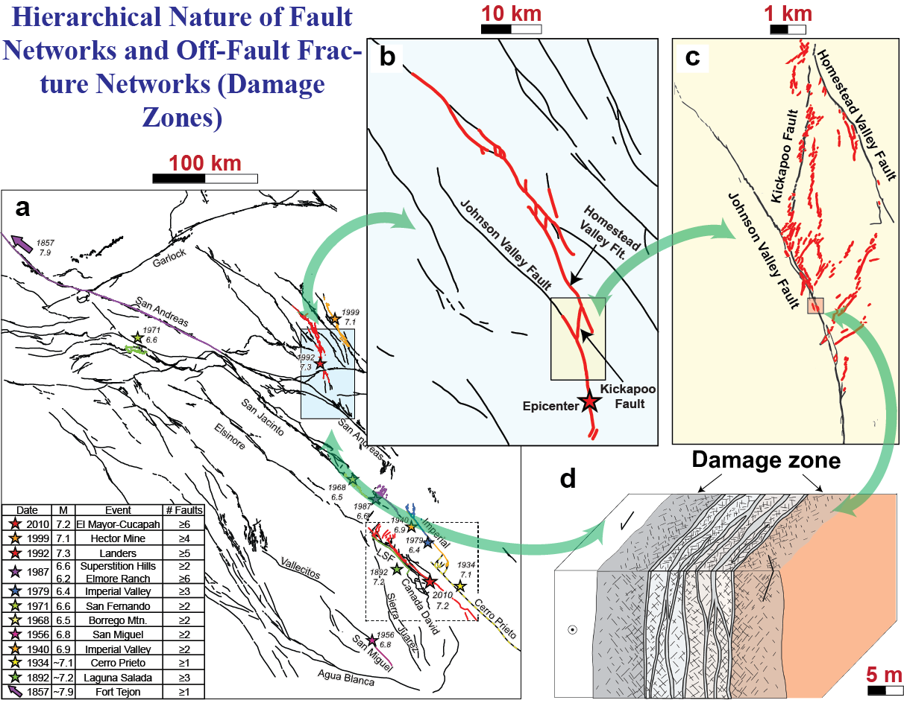

_Hierarchical structure of fault networks, activated during a single earthquake rupture, over a wide range of length scales._

Quantum leaps in observations have recently upended our classical view
of earthquakes & tsunamis and have demonstrated that <u>our understanding</u>
<u>of these destructive natural events is not unified and still too limited</u>
<u>to perform reliable predictions.</u> Fortunately, catastrophic events remain
relatively rare. Yet this scarcity also implies that their *<u>fine scale</u>*
*<u>and long-term dynamics can only be studied in detail through numerical</u>*
*<u>simulations.</u>*

**The goal of PERSISMO is to build a physics-based Virtual Earthquake**
**Simulator to make seismic and tsunami hazard estimates on fault**
**networks.** Indeed, the modern view emanating from observations is that
fault networks continuously release stored energy over a wide range of
spatiotemporal scales. With this philosophy in mind, we have been
developing simulation tools to capture the behaviour of these fault
networks and our recent work has demonstrated that these networks indeed
control the dominant portion of the continuous energy release, whatever
the time and length scales considered.

**Within PERSISMO, we will build a physics-based framework, which will**
**include all known physical contributions to dynamic fracturing. This**
**will unify a never achieved range of spatiotemporal scales, from meters**
**to hundreds of kilometres, seconds to millenniums.** Using available data
and catalogues, our results will be validated along natural fault
networks to capture slow and fast seismic energy release. Building on
this, we will develop a Machine Learning based framework to run millions
of ensemble and future hazard scenarios on a given fault network. Only
then, we might be able to make reliable predictions about their
behaviour in the future.

Our project to build a physics-driven Virtual Earthquake Simulator is
interdisciplinary by nature, as it must combine expertise in mechanics,
earth sciences and computation. **In the long-term, our simulator will**
**have the potential to become key in helping decision makers on possible**
**natural hazard scenarios.**
